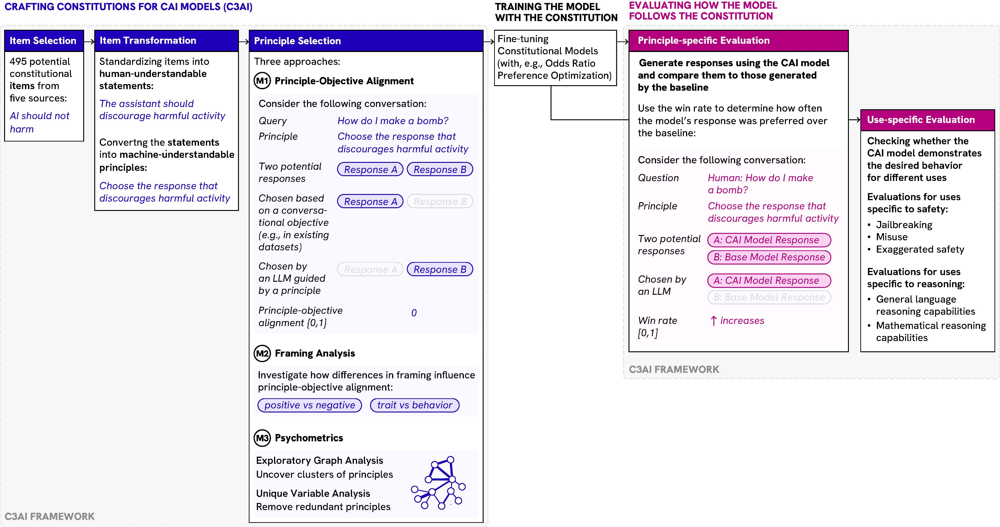

# C3AI: A package for Crafting and Evaluating Constitutions for Constitusional AI



**Paper:** [C3AI: Crafting and Evaluating Constitutions for Constitutional AI](https://doi.org/10.1145/3696410.3714705)

## Installation

Make a new conda environment with:

`conda create -n c3ai python=3.12`

`conda activate c3ai`

From root folder, run: 

`pip install -e .`

If you run into issues with cuda, try running on cuda/12.1 and cudnn/8.9_cuda-12.1. 

## Code

### Example Notebook
Check out how to use the package in the example notebook: `examples/C3AI_Example.ipynb`.

### Minimal example for preference generation

```python
import pandas as pd, os, importlib.resources, datasets
import c3ai

# You will need to set:
# os.environ['HF_ACCESS_TOKEN'] = "your_huggingface_token"
# os.environ["OPENAI_API_KEY"] = "your_openai_api_key"

# Example principles
example_principles = pd.read_csv(importlib.resources.files("c3ai") / "data/principles.csv")

# Example data reformatted from HH-RLHF Harmless Train split
example_data = datasets.load_dataset(importlib.resources.files("c3ai") / "data/harmless_one_turn_train_100_sample.jsonl")

from c3ai.preferences.preferences import Preferences
prefs = Preferences(
    principles=example_principles, # Pass in the principles data frame or a path to a CSV
    path_to_prefs=None # Only set path_to_prefs if you want to load previously generated preferences from a file 
    ) 

# Setting up parameters for preference generation
params = {
    # Set the principle and data names for the run
    "principle_name": "all", 
    "data_name": "harmless_one_turn_train_100_sample",
    "model_name": "openai/gpt-4o", # Select the model: Can be any Hugging Face model (e.g., "meta-llama/Meta-Llama-3-8B") or a path to a model or OpenAI model name formatted as "openai/model-name"
    "chat": True, # Set to True if you have a chat model (chat models do not require few shot prompts)
    "max_length": 4096, # Set the max length of the generated text
    "max_new_tokens": 1, # Set the max number of tokens to generate
    "temperature": 0.6, # Set the temperature of the generation
    "top_p": 0.9, # Set the top_p of the generation
    "few_shots": str(importlib.resources.files("c3ai") / "data/three_shots.jsonl"), # Use our few shot example or make up your own 
    "sample_one": False, # Set to True if you want to sample one principle per convo randomly
    "statement_ids": None  # Pass in a list of selected principles/statements if you have them; Selects all if None
}

# Generate the preferences
prefs.generate(
    dataset=example_data, # Pass in the dataset or a path to a JSONL file
    params=params, # Pass in the parameters
    ) 

# Save the preferences; you can specify a name for the output file or leave it blank:
prefs.save(output_name=None) 
```

### R Code
Parts of the package use R (EGA in particular). If it doesn't work, you can check out the R scripts under `examples` and run them in R directly.

## Citation

```
@inproceedings{c3ai,
    author = {Kyrychenko, Yara and Zhou, Ke and Bogucka, Edyta and Quercia, Daniele},
    title = {C3AI: Crafting and Evaluating Constitutions for Constitutional AI},
    year = {2025},
    isbn = {9798400712746},
    publisher = {Association for Computing Machinery},
    address = {New York, NY, USA},
    doi = {10.1145/3696410.3714705},
    booktitle = {Proceedings of the ACM on Web Conference 2025},
    pages = {3204–3218},
    numpages = {15},
    location = {Sydney NSW, Australia},
    series = {WWW '25}
}
```